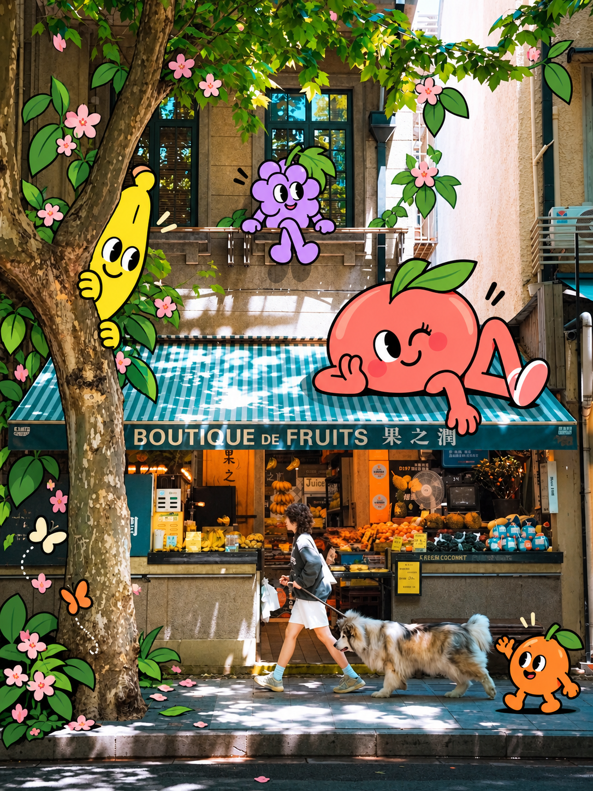
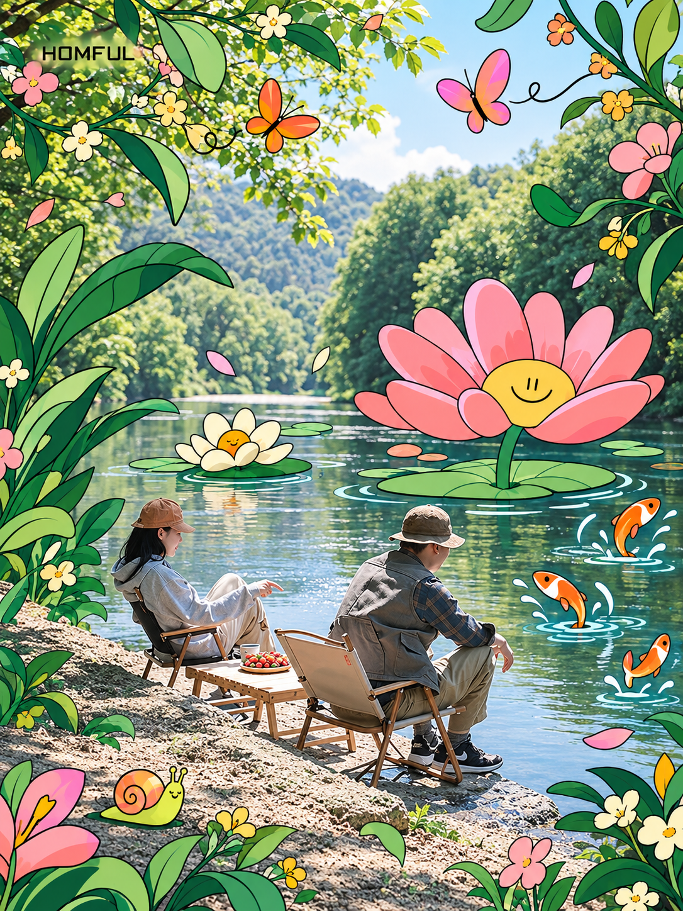
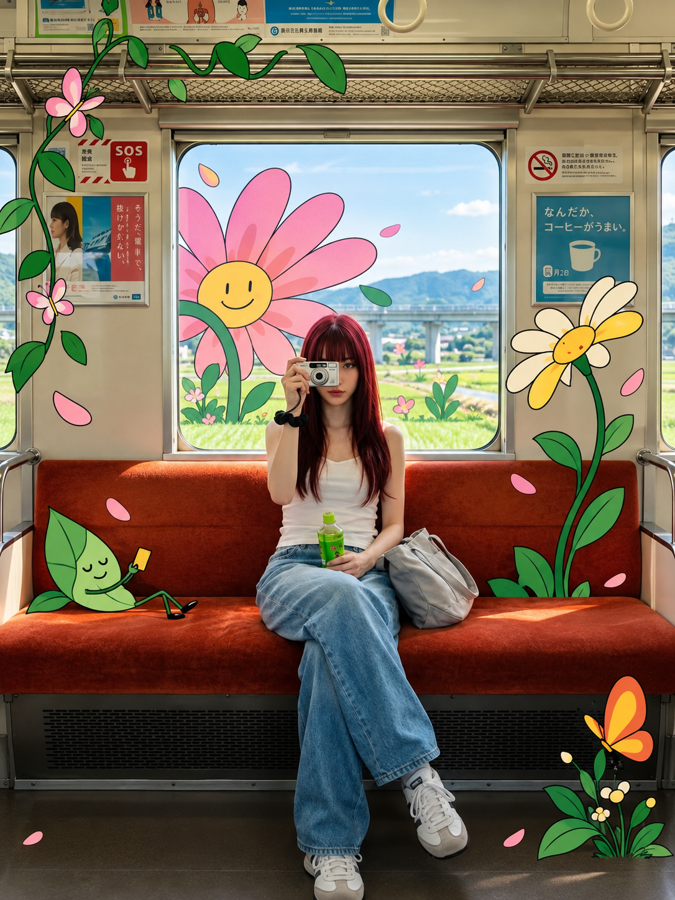
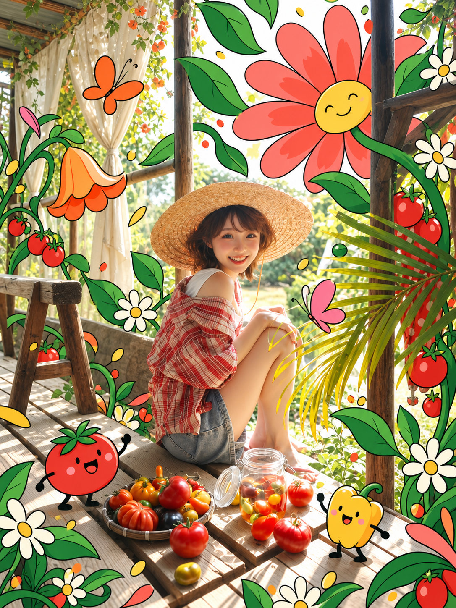
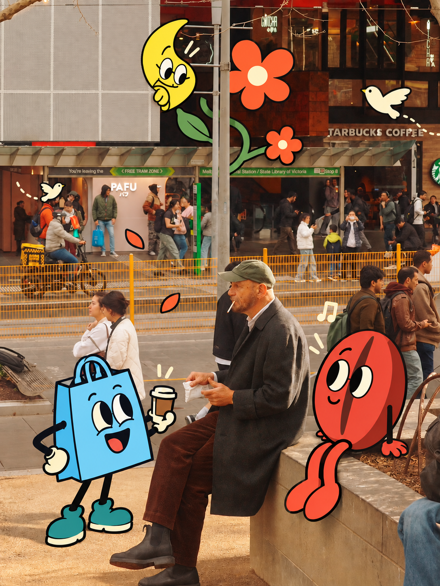
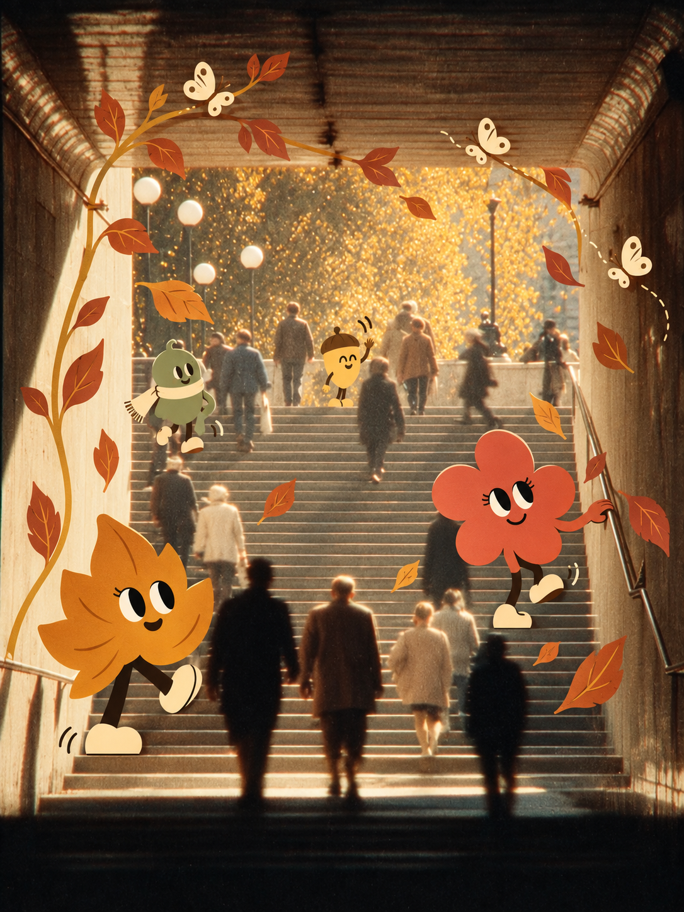

# 实景插画风 · City Illustration Mix

让二维人物、花草和趣味角色进入照片里的真实空间。

一个可以在 Codex 中使用的图片风格 Skill：保留照片的场景特征，加入平面插画，并根据每张照片重新设计构图、动作和遮挡关系。

**摄影场景 × 二维插画 × 空间互动**

## 效果展示

以下是项目制作过程中生成的效果示例。点击图片可查看完整尺寸；每次生成的结果会随输入图片、模型与提示调整而变化。

<table>
  <tr>
    <td width="50%"><a href="references/images/fruit-shop.png"></a><br><strong>水果小店</strong></td>
    <td width="50%"><a href="references/images/lakeside.png"></a><br><strong>湖畔奇想</strong></td>
  </tr>
  <tr>
    <td><a href="references/images/garden-train.png"></a><br><strong>花园列车</strong></td>
    <td><a href="references/images/summer-garden.png"></a><br><strong>夏日花园</strong></td>
  </tr>
  <tr>
    <td><a href="references/images/street-companions.png"></a><br><strong>街头伙伴</strong></td>
    <td><a href="references/images/autumn-stairs.png"></a><br><strong>秋日阶梯</strong></td>
  </tr>
</table>

## 它能做什么

- 根据照片的主体、透视和留白，设计适合当前场景的角色与构图。
- 保持清晰的二维画法：平面色块、简洁线条、克制的阴影。
- 用前后遮挡、落脚点和接触动作，让插画与实景发生互动。
- 支持单主角、角色群像、花草奇想等方向，避免每张图套同一个版式。
- 默认沿用输入比例，也可以明确指定 3:4 等比例。

这是一套供 AI 执行的风格规则和工作流程，需要能生成、编辑图片的工具支持。它不是模型权重、滤镜软件或独立生图服务。

## 安装到 Codex

### 方式一：让 Codex 安装

把下面这句话发给 Codex：

```text
请使用 skill-installer，从 https://github.com/YYeWan/city-illustration-mix 安装根目录中的 city-illustration-mix Skill。
```

### 方式二：手动安装

在 macOS / Linux 终端运行：

```bash
mkdir -p "${CODEX_HOME:-$HOME/.codex}/skills"
git clone https://github.com/YYeWan/city-illustration-mix.git \
  "${CODEX_HOME:-$HOME/.codex}/skills/city-illustration-mix"
```

安装后在下一轮对话调用；如果没有出现，重新打开任务再试。已有同名文件夹时先核对版本，不要直接覆盖自己的修改。

## 使用

上传一张照片，然后输入：

```text
用 $city-illustration-mix 把这张照片做成实景插画风，输出比例为 3:4。
```

也可以补充方向：

```text
保留这张街景的建筑和人物，加入与水果店有关的二维角色，画面丰富一些。角色和道具根据这张照片重新设计，不照搬示例。
```

有自己的风格参考图时，可以和场景图一起上传，并说明哪张是场景、哪张只提供画风。

### 多张图片如何保持风格、又避免构图重复

```text
用这个 Skill 分别处理这些照片。保持插画画法和配色关系一致，根据每张照片的主体、留白和透视独立设计构图，不固定角色的位置与大小。
```

### 生成结果不满意时

指出具体问题，例如：

```text
这几张图的角色都集中在底部，构图太像了。请检查 Skill 中导致重复布局的规则，保留二维画风，根据每张照片重新安排主角、陪衬与空间互动，再用同一组照片测试。
```

## 文件结构

```text
city-illustration-mix/
├── SKILL.md                    核心规则与执行流程
├── agents/openai.yaml          Codex 中的名称与默认调用提示
├── references/
│   ├── visual-system.md        视觉配方与示例选择
│   ├── quality.md              成图检查与修正方法
│   └── images/                 六张生成效果示例
├── README.md
├── MEDIA.md                    图片来源与许可范围
└── LICENSE                     Skill 文本与代码的 MIT 许可
```

## 效果边界

照片保留是生成目标，不代表背景像素完全不变。图生图可能改动人物、建筑细节或文字，请对照原图检查。输出通常是单张合成图片，不等于分层工程文件。具体能否直接出图，取决于使用环境是否提供相应的图片工具。

## 许可与素材

Skill 文本、配置和代码采用 [MIT License](LICENSE)。展示图片不包含在 MIT 授权范围内，详见 [图片说明](MEDIA.md)。原始外部参考图未随公开版分发。

欢迎分享仓库链接、提出问题，或提交适用于不同场景的规则改进。

---

**English:** A Codex skill for mixing real photographs with flat 2D characters, plants and playful objects. It adapts composition and spatial interaction to each input rather than repeating a fixed layout. Requires an image generation/editing tool. Instructions and code are MIT-licensed; example images are excluded from that license.
