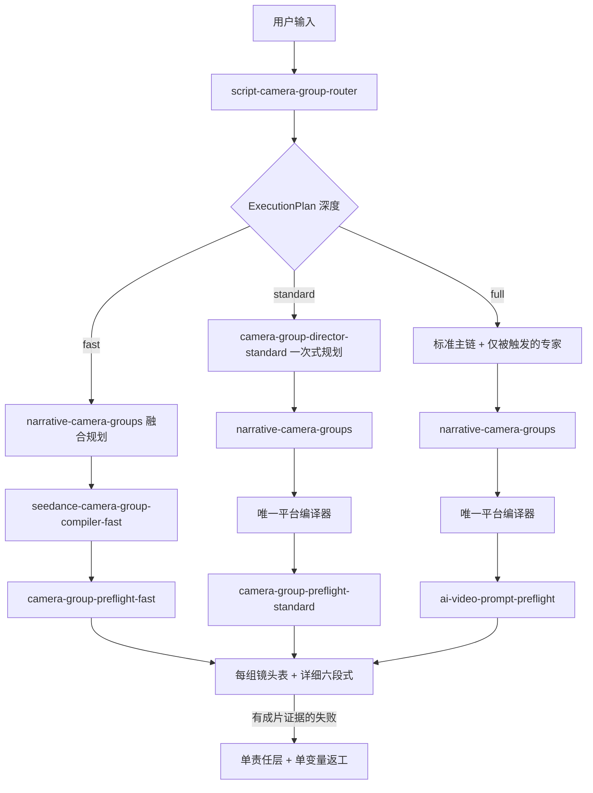

# mr-li-seedance-25 v2.0 融合改进方案

## 1. 结论

本次采用“共享治理层 + 增强现有专业 Skill + 增强现有平台编译器”的融合方式，不整包安装、不替换现有导演总控。外部 Skill 的权威版本、容量预检、镜头组编译、资产分工、单变量返工和正式交付审计被拆到现有职责链中；其 154 KB 单文件 runtime、重复总控入口和项目特有硬规则不进入正式技能目录。

外部压缩包继续作为只读来源档案：

`E:/xwechat_files/wxid_m08c3bhqbaod22_bb9c/msg/file/2026-09/（skill本体）mr-li-seedance-25-v2.0.zip`

审阅副本：

`G:/工作/分镜/.workbuddy/mr-li-seedance-25-review/mr-li-seedance-25/`

## 2. 已确认决策

| 决策面 | 采用规则 |
|---|---|
| 融合形态 | 新增共享治理 Skill，并增强现有导演、镜头组、平台编译和预检 Skill |
| 完整剧本 | 全局拆解后进入六段式镜头组流程 |
| 局部片段 | 建立局部镜头组，每组输出详细六段式 |
| 输出格式 | 所有剧本输入固定 `six_part`；用户可指定语言和展示细节，但不降级为自然段 |
| 镜头组 / 生成段 | 逻辑分离，默认 1:1；模型上限或复杂度不允许时才 1:N |
| 剧本权限 | 台词、动作、人物事实、因果和结果默认不可改；建议需用户采纳后才升级权威版本 |
| 七阶段流程 | 新项目且模糊时展示；明确任务直接进入对应阶段 |
| 资产准备 | 完整剧本建全局清单；片段只查本段资产；只有 P0 缺失阻塞正式制作 |
| 资产编号 | 内部稳定 `asset_id` + 外部平台 handle 双层映射 |
| 声音 | 默认对白/画外音 + 有物理来源拟音；音乐和氛围只在明确要求时启用 |
| 风格人名 | 默认只作内部机制分析，最终转译为具体镜头、光线、材质与表演语言 |
| 分镜参考图 | 不主动触发；仅用户明确要求时进入 |
| 返工 | 有成片/截图/明确失败描述后才诊断；保留通过层，每轮改一个责任层和一个变量 |
| 项目状态 | 普通任务对话内短状态；跨场次/跨会话/正式交付才落盘 |

## 3. 外部 Skill 能力拆解与去向

| 外部能力 | 融合去向 | 处理方式 |
|---|---|---|
| 权威剧本、用户修改稿/分析稿分离 | `ai-video-production-governance` | 作为硬治理规则 |
| 七阶段制作流程 | `ai-video-production-governance` | 改成自适应呈现 |
| 单局部单元编译 | 治理层 + 镜头组 Owner | 转译为“一个局部镜头组一个完整六段式提示词” |
| 容量预检、过密拆段 | 治理层 + preflight | 不删台词、不用加速代替拆分 |
| 文戏/动作/混合戏判断 | 现有导演与专业 Skill | 保留现有 Owner，不重复实现 |
| 资产、站位图、分镜参考图分离 | 治理层 + continuity/storyboard | 参考图改为显式触发 |
| 当前段只绑定实际资产 | 治理层 + 平台编译器 | 通过资产角色与句柄映射实现 |
| 场内文字/后期字幕分离 | 现有平台/交付检查 | 作为交付边界，不新增 Owner |
| 单变量返工 | 治理层 + iteration doctor | 采用结果驱动规则 |
| manifest、哈希、目录安全审计 | director-skill-console | 新增 `delivery-audit` 入口 |
| 单文件 runtime 构建 | 不并入当前主链 | 仅在将来需要便携版时从源构建 |

## 4. 目标架构与协同顺序

`script-camera-group-router` 是唯一隐式入口，必须先生成确定性的
`ExecutionPlan`，再加载下游 Skill。低风险局部或单场景、素材明确且为
Seedance T2V/I2V 时使用 `fast`；普通完整剧本默认 `standard`；动作、
特效、复杂连续性、素材冲突、平台研究或成片返工时使用 `full`。处理
深度只改变后台分析量，不改变镜头组、镜头表、详细六段式、镜头编号块
和 T 微节拍。



共享状态链：

```text
TaskEnvelope
-> ExecutionPlan
-> RouteReceipt
-> ResearchReceipt（仅需要研究时）
-> GovernanceState
-> StoryContract
-> ContinuityContract
-> InformationLedger
-> SpaceContract
-> ShotLedger
-> CameraGroupPlan
-> GenerationSegmentPlan
-> PlatformPromptSet
-> QCReport
```

## 5. Skill 所有权矩阵

| 控制面 | 唯一 Owner | 其他 Skill 的权限 |
|---|---|---|
| 权威版本、阶段、范围、容量、资产状态、交接 | `ai-video-production-governance` | 只能提交状态补丁 |
| 镜头组深度路由 | `script-camera-group-router` | 唯一隐式入口，先写 `ExecutionPlan` |
| 标准/完整导演意图 | `ai-video-prompt-director` | 只在 `standard/full` 被路由器显式加载 |
| 故事与信息推进 | `screenwriting-story-craft`、`shot-information-progression` | 不直接写最终平台 Prompt |
| 连续性事实 | `character-continuity-bible` | 不改剧本权威 |
| 镜头设计 | `professional-storyboard-director` | 输出 `ShotLedger` |
| 镜头组边界与可见包装 | `narrative-camera-groups` | 处理所有剧本输入；完整剧本全局拆组，片段局部拆组 |
| 平台语法、模式、句柄 | 一个选定的平台编译器 | 不得改剧情、时长、连续性和镜头所有权 |
| 完整可复制性 | `narrative-camera-groups` | `full-prompt-delivery` 不进入镜头组创作链 |
| 最终通过/阻塞 | 与深度匹配的唯一 preflight | `fast/standard/full` 均只返回问题或字段补丁，不重写全文 |
| 成片故障诊断 | `ai-video-output-review` / `ai-video-iteration-doctor` | 必须基于成片、截图或明确失败证据 |

## 6. 统一六段式编译契约

### 完整剧本 / 多镜头序列

先进行全局剧情、信息、空间、连续性和镜头组划分。默认按用户需求交付全部或指定镜头组；每个镜头组有独立镜头表和独立可复制的六段式代码块：

```text
角色/资产锁定
视觉材质总控
镜头语言总控
事件节拍
声音
正向稳定约束
```

镜头表、资产清单、风险和路由说明放在代码块外。每个提示词独立包含当前组所需信息，不能引用“同上”或要求用户拼接。

### 局部片段 / 单个续接动作

只缩小规划范围，不降低交付规格。先做局部容量、连续性、资产、物理和
平台可行性检查，再建立局部 `ShotLedger` 与一个或多个局部镜头组。每组
同样提供镜头表和完整六段式提示词。

### 详细度硬门

- 六个部分必须依次出现，并包含当前组的有效控制信息，空标题或套话不通过。
- `事件节拍`逐镜写明镜头编号、时间码/时长、景别、机位/高度/角度、焦段/透视、景深/焦点、光源方向/光质/色温/阴影、运镜路径、动作/表演/原文台词、剪切触发、结束状态与承接。
- 不得用“同上”“沿用”“参考镜头表”“保持不变”等文字代替细节。
- 每个镜头组提示词必须脱离上文、镜头表和其他组后仍可独立复制生成。
- 每个镜头窗口内部再用绝对时间轴 `T=起始-结束s` 展开连续微节拍；每个
  T 段只承载一个可观察动作、表演、运镜、声音同步点或状态结果，并完整
  覆盖父镜头时间窗。

## 7. 镜头组与生成段

`CameraGroup` 是导演规划单位，保证一个完整戏剧任务、自然边界和稳定交接。`GenerationSegment` 是模型提交单位，服从当前平台的实际容量。

默认：

```text
1 CameraGroup = 1 GenerationSegment
```

允许拆分：

```text
1 CameraGroup = N GenerationSegments
```

仅在以下原因之一成立时允许：`model_limit`、`complexity`、`continuity`。每个段必须记录 `segment_id`、`group_id`、`duration`、`opening_state`、`ending_state`、`split_basis`、`split_reason`。不能用删台词、改因果、持续高速说话或无意义反应镜头解决超载。

## 8. 资产双层映射

内部资产事实源：

```text
asset_id
asset_type
asset_status
role
source_path
platform_handle
```

内部 `asset_id`、`role`、`source_path` 稳定；平台编译器只负责输出当前平台接受的 `@角色名`、`@文件名` 或后台 `{{Image N}}`。临时编号仅在没有正式 ID 时使用。每个生成段只绑定该段真实可见、动作依赖或连续性所需的资产。

## 9. 容量、对白、声音与风格

- 容量估算包括对白、停顿、听者反应、顺序动作、空间建立、道具接触、切换和结束停留。
- 无项目音频证据时，普通中文对白按约 2.8–3.2 字/秒估算；情绪表演更慢。
- 3.5–4.2 字/秒只能用于已验证的偏快语速局部校准，不能成为全局默认。
- 短剧默认只有人物对白、画外音和有物理来源拟音；音乐、氛围床、情绪音效必须有用户或权威剧本授权。
- 导演/影片/工作室名称默认只在内部承担方向检索，最终 Prompt 转译为可见的构图、景别、镜头运动、光线、材质、表演与剪辑机制。

## 10. 质量门与返工

P0 硬阻塞：权威冲突、关键身份/布局/道具/续接证据缺失、所有权冲突、时长超限、镜头时间断裂、生成段拆分无理由、最终提示词依赖外部上下文。

P1 必改：资产职责不清、六段式缺段/空段/泛化套话、事件节拍缺逐镜摄影与承接字段、对白/动作容量过载、句柄映射不稳定、声音违反默认契约。

P2 建议：非关键参考、润色、候选镜头、可选风格强化。

返工流程：

```text
检查实际结果 -> 标记已通过层 -> 定位一个主要失败机制
-> 指定一个责任 Owner -> 只改一个主要变量 -> 检查同一端点
```

没有视频、截图或明确失败描述时，不启动结果诊断；不得把单次随机失败升级为永久禁用规则。

## 11. 已实施文件

- `C:/Users/Administrator/.codex/skills/ai-video-production-governance/SKILL.md`
- `C:/Users/Administrator/.codex/skills/ai-video-production-governance/references/mr-li-fusion-contract.md`
- `C:/Users/Administrator/.codex/skills/ai-video-prompt-director/SKILL.md`
- `C:/Users/Administrator/.codex/skills/director-workflow-70/SKILL.md`
- `C:/Users/Administrator/.codex/skills/director-workflow-70/references/orchestration-contract.md`
- `C:/Users/Administrator/.codex/skills/director-workflow-70/references/liu-short-drama-contract.md`
- `C:/Users/Administrator/.codex/skills/director-workflow-70/references/short-drama-director-stack.md`
- `C:/Users/Administrator/.codex/skills/director-workflow-70/references/mandatory-stack.md`
- `C:/Users/Administrator/.codex/skills/narrative-camera-groups/SKILL.md`
- `C:/Users/Administrator/.codex/skills/narrative-camera-groups/scripts/shot_group_linter.py`
- `C:/Users/Administrator/.codex/skills/narrative-camera-groups/references/shot-group-json-schema.md`
- `C:/Users/Administrator/.codex/skills/cinematic-music-sound-design/SKILL.md`
- `C:/Users/Administrator/.codex/skills/seedance-20/SKILL.md`
- `C:/Users/Administrator/.codex/skills/jimeng-sd2-prompting/SKILL.md`
- `C:/Users/Administrator/.codex/skills/full-prompt-delivery/SKILL.md`
- `C:/Users/Administrator/.codex/skills/ai-video-prompt-preflight/SKILL.md`
- `G:/工作/分镜/director-skill-console/config/routing-contract.json`
- `G:/工作/分镜/director-skill-console/config/orchestration-state.schema.json`
- `G:/工作/分镜/director-skill-console/src/orchestration.js`
- `G:/工作/分镜/director-skill-console/src/delivery-audit.js`
- `G:/工作/分镜/director-skill-console/test/orchestration.test.js`
- `G:/工作/分镜/director-skill-console/test/delivery-audit.test.js`
- `C:/Users/Administrator/.codex/skills/script-camera-group-router/SKILL.md`
- `C:/Users/Administrator/.codex/skills/camera-group-director-standard/SKILL.md`
- `C:/Users/Administrator/.codex/skills/seedance-camera-group-compiler-fast/SKILL.md`
- `C:/Users/Administrator/.codex/skills/camera-group-preflight-fast/SKILL.md`
- `C:/Users/Administrator/.codex/skills/camera-group-preflight-standard/SKILL.md`
- `G:/工作/分镜/director-skill-console/src/skill-index.js`
- `G:/工作/分镜/director-skill-console/src/audit.js`

## 12. 明确不融合的部分

- 不把 `mr-li-seedance-25` 作为新总控直接安装，避免和现有导演/平台/交付 Skill 竞争入口。
- 不复制 154 KB `universal-runtime.md` 到正式 Skill；它是生成物，不是维护源。
- 不直接采用 3.5–4.2 字/秒作为普通对白默认。
- 不把“一镜一说话人”“50mm 以上”“固定过肩句式”升级为全局硬门禁，仅作为场景相关启发式。
- 不自动询问或制作分镜参考图。
- 不让平台编译器保存独立剧情状态或重写上游镜头规划。

## 13. 维护和回滚

后续调整应优先修改治理契约或唯一 Owner，避免在多个 Skill 重复粘贴同一规则。若某项融合导致误触发，可先从 `routing-contract.json` 暂停对应控制面，再回退相关 Skill 中的条件路由；不要删除原 ZIP 或审阅副本。单文件便携版只能由源文件重新构建，并通过源哈希一致性检查，不能手工编辑 runtime。

## 14. 验收标准

1. 输入完整剧本时，能够先完成全局拆组，再输出带 T 微节拍的六段式镜头组。
2. 输入局部片段时，只省略全局拆组和不必要的三方案问答，仍输出局部镜头表、T 微节拍与每组详细六段式。
3. 所有剧本输入的 `TaskEnvelope.output_format` 均为 `six_part`，preflight 不允许自然段旁路。
4. 一个镜头组默认一个生成段；1:N 时必须有可审计理由和状态交接。
5. 剧本台词、动作、人物事实、因果和结果未经确认不被修改。
6. 内部资产 ID 与平台句柄可追溯且不互相污染。
7. 短剧 Prompt 默认不引入音乐、氛围床或情绪音效。
8. 分镜参考图只有明确请求才触发。
9. 返工基于实际证据，每轮只改一个主要变量。
10. Skill frontmatter、路由 JSON、状态 Schema、Node 测试和控制台审计全部通过。

## 15. 后续优化优先级

P0：用真实完整剧本和真实局部片段各做一次前向验证，重点观察规划范围是否正确、Prompt 是否越权改剧本、每组六段式是否完整详细、preflight 是否拦截空段和跨引用。

P1：在正式生产项目中启用 `GenerationSegmentPlan` 与资产双层映射的实际落盘，并把生成尝试绑定到 production ledger。

P2：如确有便携单文件交付需求，再建立源文件 → runtime 构建 → 哈希快照 → ZIP 审计流水线；不要提前把大型 runtime 带入常规上下文。

## 16. v6 性能优化实施结果

本轮把原先“所有主 Skill 依次分析”的开放式调用，改成“先路由、后按白名单加载”的确定性执行：

| 深度 | 固定主链 | 避免的重复 |
|---|---|---|
| `fast` | 路由器 → 镜头组融合规划 → 轻量 Seedance 编译 → 轻量预检 | 不加载导演总控、治理、专业分镜、材质、声音、全量平台和全量预检 |
| `standard` | 路由器 → 轻量标准导演 → 镜头组包装 → 唯一平台编译器 → 标准预检 | 不加载约 86 KB 的全量导演、独立治理/摄影/材质/声音/专业分镜、旧入口和全量预检 |
| `full` | 标准主链 + 实际触发的动作/VFX/连续性/研究/复审专家 → 唯一平台编译器 → 全量预检 | 专家只返回字段补丁，不再各自产出一份完整 Prompt |

运行时新增四类硬约束：

1. `ExecutionPlan.required_skills` 和 `forbidden_skills` 必须与确定性计算结果一致。
2. 三个平台注册编译器互斥，每个最终 Prompt 的 `compile_count` 必须为 `1`。
3. 研究只允许 `creative-research-first` 执行一次，并以 `ResearchReceipt` 供后续复用。
4. 只有 `script-camera-group-router` 可以隐式进入剧本拆镜头组流程；其他重型入口必须由路由器显式选择。

这些优化只减少后台重复读取、重复研究和重复全文改写，不删减用户最终收到的镜头表、六段式正文、逐镜摄影字段或 `T=` 微节拍。

按当前 `SKILL.md` 体量估算，标准链从原约 `210.4 KB / 2483 行`
（全量导演 + 治理 + 摄影 + 专业分镜 + 材质 + 声音 + 包装 + 平台 + 预检）
降为约 `48.1 KB / 674 行`，后台 Skill 文本读取量约下降 `77%`；fast 链约
`28.9 KB / 447 行`。这是上下文加载量的工程估算，不代表模型输出正文会被
压缩，最终交付规格保持不变。
